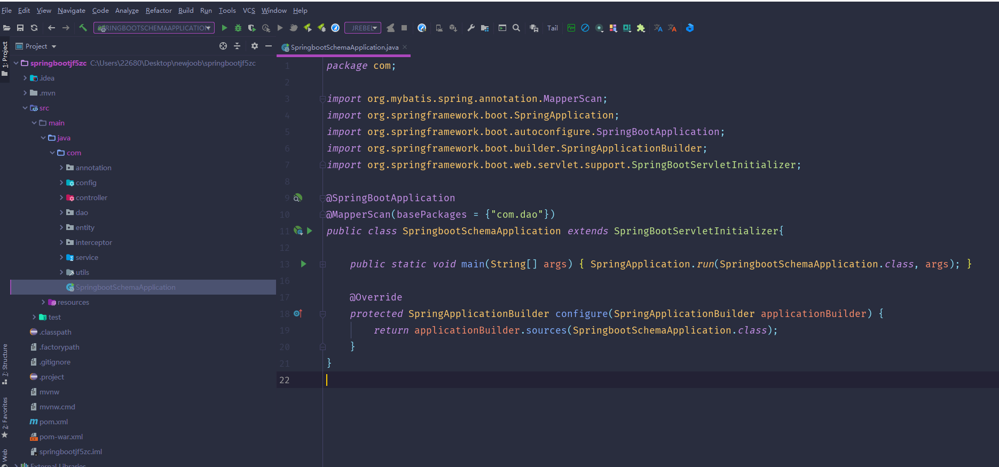
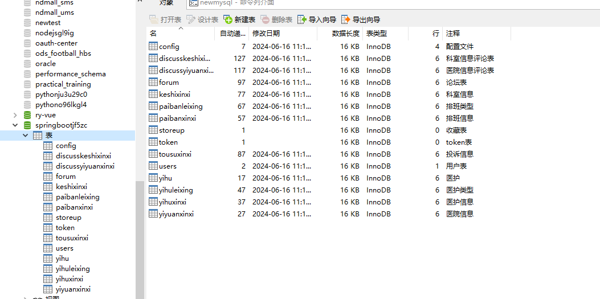
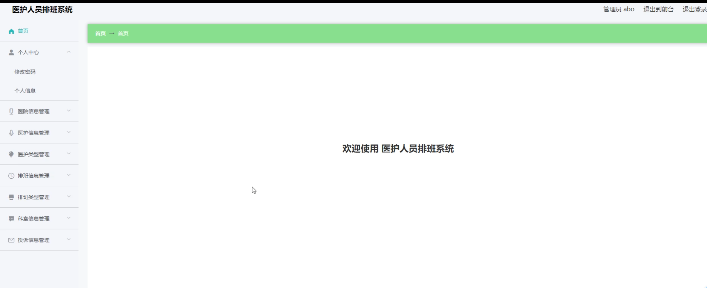
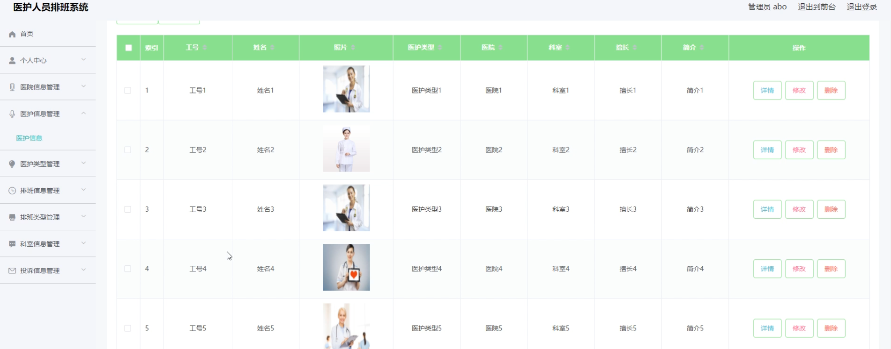
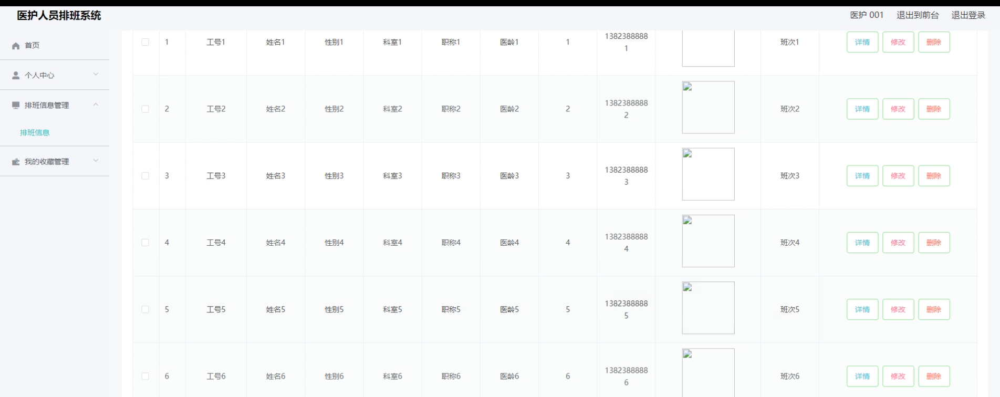
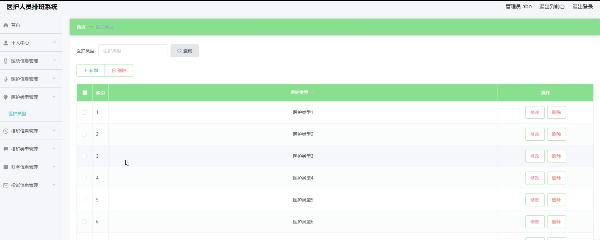
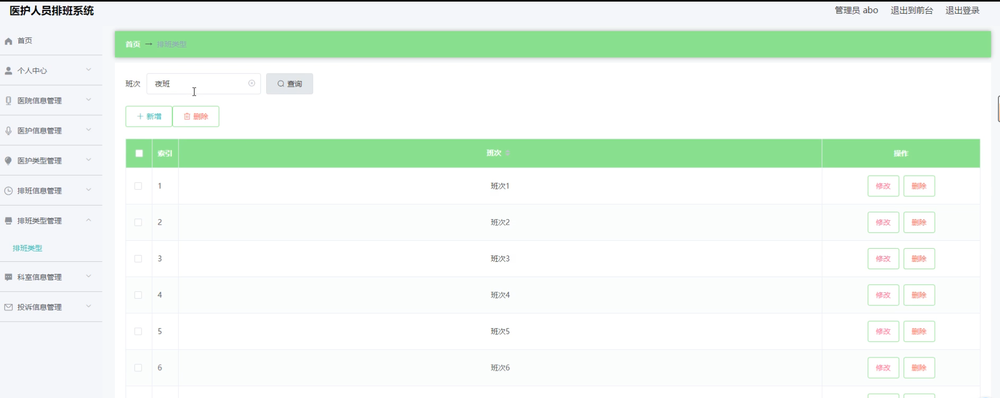
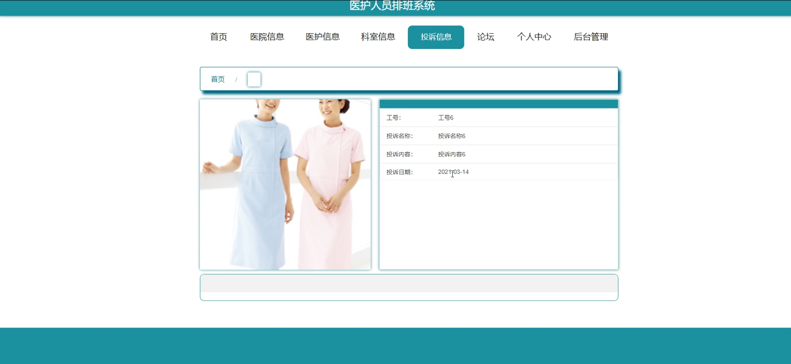

# 基于springboot的医护人员排班系统

#### 介绍
基于Spring Boot的医护人员排班系统是一个高效、便捷的管理工具，旨在为医疗机构提供智能化的排班方案以及全面的信息管理。该系统为不同角色设置了不同的功能模块，确保医护人员和管理员能够根据自己的需求高效地完成工作。

#### 技术渣栈介绍
后端技术栈：Springboot+Mysql+Maven

前端技术栈：Vue+Html+Css+Javascript+ElementUI

开发工具：Idea+Vscode+Navicate

#### 系统功能介绍

1. 管理员角色
医院信息管理：管理员可以维护医院的基本信息，如医院名称、地址、联系方式等，确保信息的准确性和完整性。  

医护信息管理：管理员可以管理医护人员的个人信息，包括姓名、性别、年龄、专业技能等，便于后续排班和人员管理。  

医护类型管理：管理员可以定义和管理不同的医护类型，如医生、护士、技师等，以适应不同科室和岗位的需求。  

排班信息管理：管理员可以生成、调整并发布排班计划，确保医护人员的工作安排合理有序。  

排班类型管理：管理员可以设置不同的排班类型，如白班、夜班、轮班等，以满足不同科室和岗位的工作需求。  

科室信息管理：管理员可以管理医院的科室信息，包括科室名称、负责人、床位数量等，便于医护人员了解各科室的工作情况。  

投诉信息管理：管理员可以查看并处理医护人员或患者提交的投诉信息，及时解决问题，提升服务质量。  

我的收藏管理：管理员可以收藏重要的信息或文档，方便后续查阅。  

2. 医护角色  

医院信息：医护人员可以查看医院的基本信息，了解医院的整体情况。  

医护信息：医护人员可以查看和更新自己的个人信息，确保信息的准确性。  

科室信息：医护人员可以查看医院的科室信息，了解自己所在科室的情况以及其他科室的基本信息。  

投诉信息：医护人员可以提交投诉信息，反映工作中遇到的问题或建议，促进医院服务的改进。  

论坛：医护人员可以在论坛中发布帖子、参与讨论，分享工作经验和心得，增进彼此之间的交流与合作  
。
排班信息管理：医护人员可以查看自己的排班计划，了解自己的工作安排，并可以在一定范围内进行微调。  

我的收藏管理：医护人员可以收藏重要的信息或文档，方便后续查阅。

#### 系统功能截图

代码结构和数据库

登录

首页

医护端医护信息

管理端医护信息

排班信息

医护类型

医院信息

排班类型

投诉信息

#### 总结
基于Spring Boot的医护人员排班系统通过为管理员和医护人员设置不同的功能模块，实现了智能化、自动化的排班管理和全面的信息管理。该系统不仅提高了工作效率，还促进了医护人员之间的交流与合作，为医疗机构提供了一站式的解决方案。
#### 使用说明
创建数据库，执行数据库脚本
修改jdbc数据库连接参数
下载安装maven依赖jar
启动idea中的springboot项目

后台地址： http://localhost:8080/springbootjf5zc/admin/dist/index.html

管理员  abo 密码 abo

前台地址：http://localhost:8080/springbootjf5zc/front/index.html

